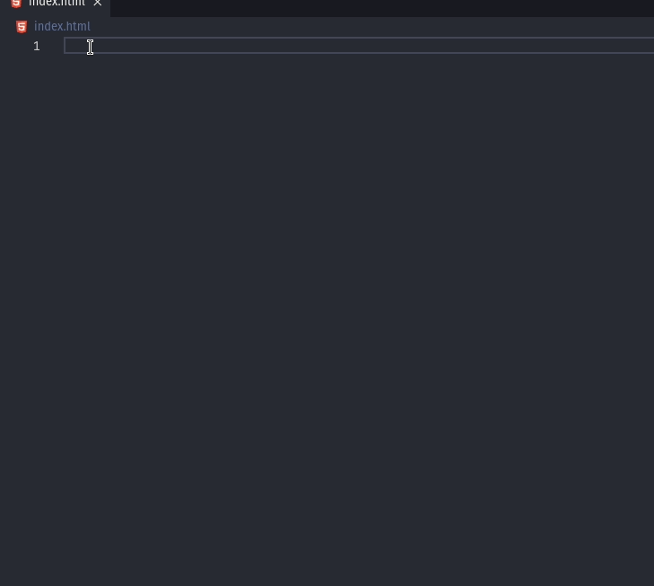
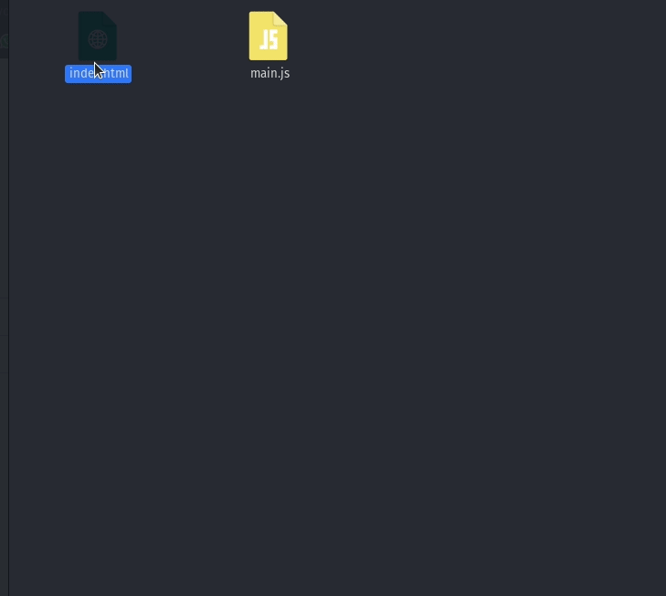
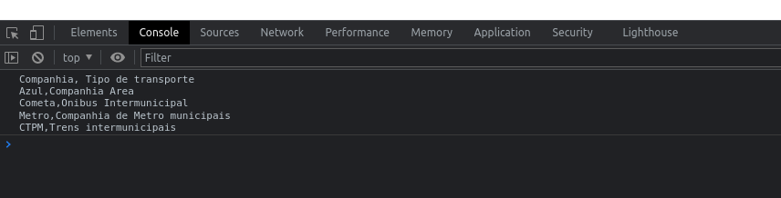

CSV é um tipo de arquivos onde os dados são separados por vírgula, daí vem a sigla da extensão CSV(comma-separated values, valores separados por virgula na tradução).

Apesar de na programação existir outros tipos de arquivos que também são úteis para se trabalhar, como arquivos JSON ou XML, que já possuem funções em quase todas as linguagens para manipular esses tipos de dados, para um usuário que precisa baixar dados de um sistema esses tipos de arquivos podem acabar não sendo a melhor escolha quando é necessário colocar esses dados em suas planilhas feitas em Excel, que é muito utilizado nas empresas.

Dessa forma o arquivo CSV se torna a melhor escolha para essa situação onde é necessário disponibilizar uma quantidade de dados para que o usuário baixe e coloque em planilhas.

Então vamos mostrar como podemos criar e disponibilizar para download dados em um arquivo CSV em **javascript**.

A forma mais simples para fazer isso é executar o script em um navegador, dessa forma vamos criar um arquivo HTML para nos auxiliar.

Utilizando O VScode, clicando no icone de novo arquivo damos o nome `index.html`, já temos nosso arquivo html criado, abrimos o arquivo e para facilitar vamos utilizar o recurso de snippets do vscode, que nos fornece trechos de códigos já prontos para podermos utilizar.

Dentro do arquivo digitamos `html`, o vscode irá nos oferecer algumas opções para escolhermos, com as setas dos teclado escolhemos a opção `html:5` e pressionamos enter, pronto temos toda uma estrutura de HTML pronto para utilizar.

{:style="width:100%;padding:10px"}

Vamos alterar o título na tag `<title>Criando Arquivo CSV</title>`, dessa forma mais a seguir quando executarmos nosso arquivo no navegador, esse titulo será escrito na aba do navegador.

Agora vamos criar um botão utilizando a tag `<button>Download</button>`.

Nesse ponto temos nosso arquivo html com um botão na tela, nesse ponto precisamos executar o arquivo no navegador, para isso abra o seu gerenciador de arquivos, navegue até a onde se encontra o arquivo `index.html` clique com o botão direito e mande executar com o navegador.

{:style="width:100%;padding:10px"}

Agora vamos começar a criar nosso arquivo **Javascript**.

Primeiro vamos criar um arquivo .js no vscode, clicando no icone de *new file* e nomeamos esse arquivo, no meu caso coloquei `main.js`.

Abrimos o arquivo no vscode, o primeiro passo é criar um array de arrays, que vai nos servir de base de dados para construirmos o nosso arquivo CSV.

```javascript
var csvDataFile = [
    ['Azul','Companhia Area'],
    ['Cometa','Onibus Intermunicipal'],
    ['Metro','Companhia de Metro municipais'],
    ['CTPM','Trens intemunicipais']
]
```

Já temos os  dados para colocarmos em nosso arquivo, agora vamos criar uma função que será executada quando precisarmos baixar os dados.

Existem duas formas basicas de se criar uma função no javascript, com a palavra reservada `function`, como mostrada abaixo.

```javascript
function domwload_data() {
 
}
```

Outra maneira de escrever uma função é com **arrow functions** que são setas de função, como mostrado abaixo.

```javascript
donwload_data = () =>{
 
}
```

Basicamente são formas diferentes de se escrever uma função mas que funcionam de forma semelhantes, nesse post vamos utilizar **arrow function**.

Então no momento nosso script está da seguinte forma:

```javascript

var csvDataFile = [
    ['Azul','Companhia Area'],
    ['Cometa','Onibus Intermunicipal'],
    ['Metro','Companhia de Metro municipais'],
    ['CTPM','Trens intermunicipais']
]

download_data = () =>{
 
}
```

Evoluindo um pouco mais nosso código, vamos criar uma variável que irá receber o titulo de nossas colunas de dados e os dados que vamos colocar no arquivo CSV, que deve ser colocado dentro da função que acabamos de criar.

```javascript
var csvDataFile = [
    ['Azul','Companhia Area'],
    ['Cometa','Onibus Intermunicipal'],
    ['Metro','Companhia de Metro municipais'],
    ['CTPM','Trens intermunicipais']
]

download_data = () =>{
    var csv = 'Companhia, Tipo de transporte\n'
 
}
```

Note que depois de escrevermos os títulos das colunas colocamos um `\n` que serve para pularmos para linha de baixo no arquivo.

Agora precisamos ler cada linha do array de dados que criamos, a melhor forma para fazer isso é utilizar a função `forEach()` do javascript. Essa função faz uma iteração em cada linha do array até que não tenha mais linha dentro do array, colocando uma função dentro do `forEach()` podemos executar uma função a cada linha do array.

Dessa forma podemos evoluir nosso código um pouco mais, ficando dessa forma:

```javascript
var csvDataFile = [
    ['Azul','Companhia Area'],
    ['Cometa','Onibus Intermunicipal'],
    ['Metro','Companhia de Metro municipais'],
    ['CTPM','Trens intermunicipais']
]

download_data = () =>{
    var csv = 'Companhia, Tipo de transporte\n'
    csvDataFile.forEach(()=>{
  
    })
}
```

Então vamos pegar o array de dados e executar uma iteração sobre ele, por todos os elementos que ele possui.

Agora vamos escrever a função que devemos executar a cada iteração. Como parâmetro vamos passar a linha que estamos, então passamos o parâmetro **row**  e dentro da função vamos executar duas ações, a primeira será pegar os dois itens do array e unir dentro da variável `csv` com o método `.join()`,
dentro desse método nós passamos o separador que será usado, como padrão o separador usado é a virgula, dessa forma não precisamos especificar nenhum caracter. A segunda ação que vamos tomar é fazer que o arquivo passe a ser escrito na próxima linha a partir da próxima iteração, então  adicionamos uma linha utilizando o `\n`, nosso código está dessa forma agora:

```javascript

var csvDataFile = [
    ['Azul','Companhia Area'],
    ['Cometa','Onibus Intermunicipal'],
    ['Metro','Companhia de Metro municipais'],
    ['CTPM','Trens intermunicipais']
]

download_data = () =>{
    var csv = 'Companhia, Tipo de transporte\n'
    csvDataFile.forEach((row)=>{
        csv += row.join()
        csv += '\n'
    })
}
```

Já podemos ver nosso código executar no navegador, porem precisamos fazer com que ele seja executado assim que clicar no botão que criamos no html, então voltando ao arquivo `index.html` vamos adicionar o caminho do script no arquivo  html, para isso antes do fechamento da tag `<body></body>` vamos adicionar a tag `<script></script>` e dentro da tag de abertura vamos colocar o parâmetro src passando o caminho do script que queremos carrega com a pagina, dessa forma nosso arquivo `index.html` fica assim:

```html
<!DOCTYPE html>
<html lang="en">
<head>
    <meta charset="UTF-8">
    <meta http-equiv="X-UA-Compatible" content="IE=edge">
    <meta name="viewport" content="width=device-width, initial-scale=1.0">
    <title>Criando Arquivo CSV</title>
</head>
<body>
    <button>Download CSV</button>
    <script src="main.js"></script>
</body>
</html>
```

Agora vamos na tag `<button>Download CSV</button>` e adicionamos o parâmetro `onclick`, esse parâmetro serve para que possamos passar para o botão uma função para ser executada assim que o botão for clicado, nesse caso vamos passar a função que criamos no nosso arquivo `main.js` que chama `download_data()` ficando o arquivo html dessa forma:

```html
<!DOCTYPE html>
<html lang="en">
<head>
    <meta charset="UTF-8">
    <meta http-equiv="X-UA-Compatible" content="IE=edge">
    <meta name="viewport" content="width=device-width, initial-scale=1.0">
    <title>Criando Arquivo CSV</title>
</head>
<body>
    <button onclick="download_data()">Download CSV</button>
    <script src="main.js"></script>
</body>
</html>
```

Pronto, nosso script já irá executar assim que clicarmos no botão, porem não colocamos uma saída para visualizarmos os dados, então vamos colocar um `console.log` passando o arquivo csv para visualizarmos no console do navegador o arquivo que acabamos de criar:

```javascript
var csvDataFile = [
    ['Azul','Companhia Area'],
    ['Cometa','Onibus Intermunicipal'],
    ['Metro','Companhia de Metro municipais'],
    ['CTPM','Trens intermunicipais']
]

download_data = () =>{
    var csv = 'Companhia, Tipo de transporte\n'
    csvDataFile.forEach((row)=>{
        csv += row.join()
        csv += '\n'
    })
    console.log(csv)
}
```

Agora ao executarmos o arquivo no navegador e clicarmos no botão temos o seguinte resultado:

{:style="width:100%;padding:10px"}

Nesse ponto já temos todos os nossos dados em uma string, agora vamos criar um elemento html que não irá aparecer em nossa pagina, vamos atribuir esse elemento a uma variável que vamos chamar de ancora pois é uma tag `<a>`.

```javascript
var csvDataFile = [
    ['Azul','Companhia Area'],
    ['Cometa','Onibus Intermunicipal'],
    ['Metro','Companhia de Metro municipais'],
    ['CTPM','Trens intermunicipais']
]

download_data = () =>{
    var csv = 'Companhia, Tipo de transporte\n'
    csvDataFile.forEach((row)=>{
        csv += row.join()
        csv += '\n'
    })
    var ancora = document.createElement('a')
    console.log(csv)
}
```

Vamos passar um valor para o parametro href, no qual vamos definir o tipo de dado que estamos manipulando.

```javascript
var csvDataFile = [
    ['Azul','Companhia Area'],
    ['Cometa','Onibus Intermunicipal'],
    ['Metro','Companhia de Metro municipais'],
    ['CTPM','Trens intermunicipais']
]

download_data = () =>{
    var csv = 'Companhia, Tipo de transporte\n'
    csvDataFile.forEach((row)=>{
        csv += row.join()
        csv += '\n'
    })
    var ancora = document.createElement('a')
    ancora.href = 'data:text/csv;charset=utf-8,'+encodeURI(csv)
    console.log(csv)
}
```

Atribuímos um valor para o target como blank dessa forma o navegador irá abrir a funcionalidade de Download.

```javascript
var csvDataFile = [
    ['Azul','Companhia Area'],
    ['Cometa','Onibus Intermunicipal'],
    ['Metro','Companhia de Metro municipais'],
    ['CTPM','Trens intermunicipais']
]

download_data = () =>{
    var csv = 'Companhia, Tipo de transporte\n'
    csvDataFile.forEach((row)=>{
        csv += row.join()
        csv += '\n'
    })
    var ancora = document.createElement('a')
    ancora.href = 'data:text/csv;charset=utf-8,'+encodeURI(csv)
    ancora.target = '_blank'
    console.log(csv)
}
```

E por último vamos executar via programação o clique no link que acabamos de criar, dessa forma iremos pegar os dados da string, converter para um arquivo CSV e fazer o download desse arquivo.

```javascript
var csvDataFile = [
    ['Azul','Companhia Area'],
    ['Cometa','Onibus Intermunicipal'],
    ['Metro','Companhia de Metro municipais'],
    ['CTPM','Trens intermunicipais']
]

download_data = () =>{
    var csv = 'Companhia, Tipo de transporte\n'
    csvDataFile.forEach((row)=>{
        csv += row.join()
        csv += '\n'
    })
    var ancora = document.createElement('a')
    ancora.href = 'data:text/csv;charset=utf-8,'+encodeURI(csv)
    ancora.target = '_blank'
    ancora.click()
    console.log(csv)
}
```

Pronto! Agora temos nosso arquivo CSV disponível para utilizar baixado em nossa maquina.
  
E aí, o que achou deste post?  Deixe aí nos comentários se este post foi útil pra você!
